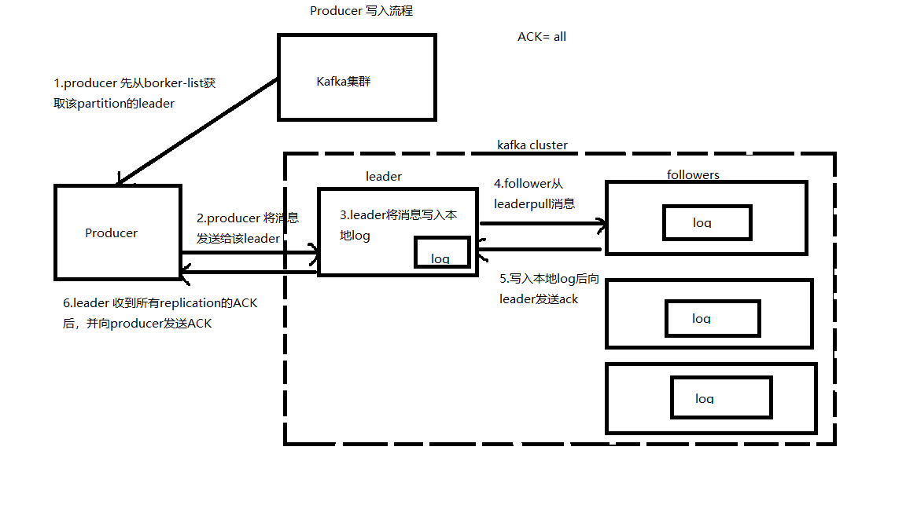
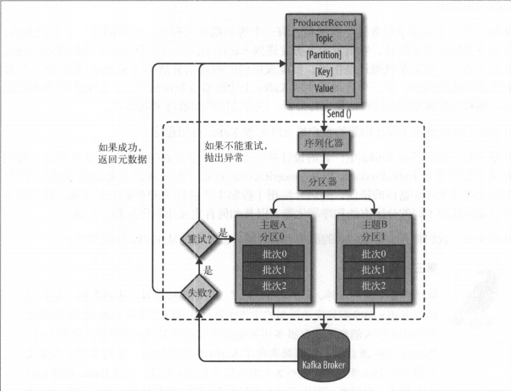
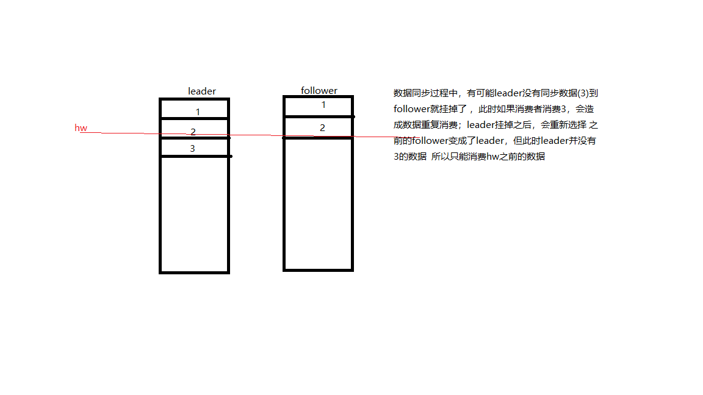

# Kafka
## Kafka是一个分布式消息队列，具有高性能、持久化、多副本备份、横向扩展能力.(pub-sub模型)
> 维基百科
>> Kafka 是由Apache软件基金会开发的一个开源流处理平台，由Scala和JAVA编写.该项目的目标是为处理实时数据提供一个统一、高吞吐、低延迟的平台。其持久化层本质是一个"按照分布式事务日志架构的大规模发布/订阅消息队列".Kafka可以通过Kafka Connect连接到外部系统(用于数据输入/输出),并提供了Kafka Streams ———— 一个Java流式处理库.


## 基于kafka-zookeeper 的分布式消息队列系统总体架构如下：


> Kafka 架构说明
>> 一个典型的Kafka集群包含若干Producer，若干Broker，若干Consumer，以及一个Zookeeper集群。Kafka通过Zookeeper管理集群配置，选举Leader，以及在Consumer Group发送变化时进行Rebalance(负载均衡)。Producer 使用push(推)模式将消息发布到Broker；Consumer 使用pull(拉)模式从Broker订阅并消费消息。

> Kafka 四大核心
>>
- 生产者API：允许应用程序发布记录流至一个或多个kafka的主题(Topics)<br>
- 消费者API：允许应用程序订阅一个或多个主题，并处理这些主题接收到的记录流<br>
- Streams API: 允许应用程序充当流处理器(stream processor)，从一个或多个主题获取输入流，并生产一个输出流至一个或多个的主题，能够有效地变换输入流为输出流<br>
- Connector API: 允许构建和运行可重用的生产者或消费者，能够把kafka主题连接到现有的应用程序或数据系统

> Kafka 基础概念

- 无论是kafka集群，还是consumer都依赖于zookeeper集群保存一些meta信息，来保证系统可用性
- Producer 采用推(push)模式将消息发布到broker，每条消息都被追加(append)到分区(partition)中，属于顺序写磁盘(顺序写磁盘效率比随机写内存要高，保障kafka吞吐率)
- Producer
- - 发送消息者称为 Producer



- 生产者组件图



- 创建Kafka生产者
- - 要往Kafka写入信息，首先要创建一个生产者对象，并设置一些属性。Kafka生产者有3个必选属性
- bootstrap.servers
- - 该属性指定broker的地址清单，地址的格式为host:port。清单里不需要包含所有的broker地址，生产者会从给定的broker里查找到其他的broker的信息。(建议提供两个broker信息，一旦其中一个宕机，生产者仍然能够连接到集群上)
- key.serializer
- - broker 希望接受到的消息的键和值都是字节数组.生产者接口允许使用参数化类型，因此可以把java对象作为键和值发送给broker。
- value.serializer
- - value.serializer 指定的类会将值序列化。如果键和值都是字符串，可以使用key.serializer一样的序列化器。如果键是整数类型而值是字符串，那么需要使用不同的序列化器.

> 生产者的配置

| 参数 | 描述 |
| ---  | --- |
| acks | acks 参数指定了必须要有多少个分区副本收到消息，生产者才会认为消费写入是成功的。acks = 0  生产者在成功写入消息之前不会等待任何来自服务器的响应。(缺点：无法确认消费是否成功；优点：高吞吐量)；acks = 1 只要集群的首领节点收到消息，生产者就会收到一个来自服务器的成功响应。如果消费无法到达首领节点(比如首领节点奔溃，新的首领还没有被选举处理)，生产者会收到一个错误响应，为了避免数据丢失，生产者会重发消息。不过，如果一个没有收到消息的节点成为新首领，消息还是会丢失。acks = all 只有当所有参与复制的节点全部收到消息时，生产者才会收到一个来自服务器的成功响应。|
|buffer.memory |该参数用来设置生产者缓冲区的大小，生产者用它缓冲要发送到服务器的消息。0.9.0.0 版本被替换成了 max.block.ms,表示在抛出异常之前可以阻塞一段时间 |
| compression.type |  默认情况下为none，消费发送时不会被压缩。该参数可以设置为snappy、gzip或lz4，它指定了消息被发送给broker之前使用哪一种压缩算法进行压缩。1. snappy 压缩算法有Google发明，它占用较少的CPU，却能提供较好的性能和相当可观的压缩比(比较关注性能和网路带宽) 2. gzip 压缩算法一般会占用较多的CPU，但会提供更高的压缩比(网络带宽有限次采用)|
| retries | 生产者从服务器收到的错误有可能是临时性的错误(比如分区找不到首领)。在这中情况下，retries参数是值决定了生产者可以重发消息的次数，如果达到这个次数，生产者会放弃重试并返回错误。默认情况下，生产者会在每次重试之间等待100ms，可以通过retry.backoff.ms参数来改变这个时间间隔. |
|batch.size | 当有多个消息需要被发送到同一个分区时，生产者会把它们放在同一个批次里。该采纳数指定了一个批次可以使用的内存大小，按照字节数计算(而不是消息个数)。1. 批次设置很大  不会造成延迟，只会占用更多的内存 2. 批次设置很小  因为生产者需要更频繁地发送消息，会增加一些额外的开销|
|linger.ms | 该参数指定了生产者在发送批次之前等待更多消息加入批次的时间。 |
| client.id | 该参数可以是任意的字符串，服务器会用它来识别消息的来源，还可以用在日志和配额指标里 |
| request.timeout.ms | 指定了生产者在发送数据时等待服务器返回响应的时间  |
|max.block.ms | 该参数指定了在调用send()方法或使用partitionsFor()方法获取元数据时生产者的阻塞时间。当生产者的发送缓冲区已满，或者没有可用的元数据时，这些方法就会阻塞。在阻塞时间达到max.block.ms时，生产者会抛出超时异常 |
| max.request.size  |该参数用于控制生产者发送的请求大小。它可以指能发送的单个消息的最大值，可以指单个请求里所有消息总的大小。 |


- Consumer
- - 消息接收者称为Consumer
- - consumer 采用pull(拉)模式从broker中读取数据
- - push(推) 模式很难适应消费速率不同的消费者，因为消息发送速率是由broker决定的。它的目标是尽可能以最快速度传递消息，但是这样很容易造成consumer来不及处理消息，典型的表现就是拒绝服务以及网络拥塞。而pull模式则可以根据consumer的消费能力以适当的速率消费消息
- - 对于Kafka而言,pull模式更合适，它可简化broker的设计，consumer可自主控制消费消息的速率，同时consumer可以自己控制消费方式——即可批量消费也可逐条消费， 同时还能选择不同的提交方式从而实现不同的传输语义
- - pull 模式不足之处是，如果kafka没有数据，消费者可能会陷入循环中，一直等待数据到达。为了避免这种情况，我们在拉请求中有参数，允许消费者请求在的等待数据到达的"长轮询"中进行阻塞(并且可选地等待到给定的字节数，以确保打的传输大小)
- Consumer Group (CG)
- - 这是kafka用来实现一个topic消息的广播(发给所有的consumer)和单播(发给任意一个consumer)的手段。一个topic可以有多个CG。topic的消息会复制(概念上的复制)到所有的CG，但每个partition只会把消息发给该CG中的一个consumer。如果需要实现广播，只要每个consumer有一个独立的CG就可以了。要实现单播只要所有consumer在同一个CG。用CG还可以将consumer进行自由的分组而不需要多次发送消息到不同的topic
- - 每个分区在同一时间只能由group中的一个消费者读取，但是多个group可以同时消费这个partition。
- - 消费者通过向被指派为群组协调器的broker发送心跳来维持它们和群组的从属关系以及它们对分区的所有权关系.

- Broker(代理)
- - 已发布的消息保存在一组服务器中，称之为Kafka集群。集群中的每一个服务器都是一个代理。
- 主题(Topic)
- - Kafka将消息以topic为单位进行归纳(一条消息必须属于某一个主题)
- - 在Kafka集群中，可以有无数的主题
- - Kafka 的主题始终是支持多用户订阅的；也就是说，一个主题可以有零个，一个或多个消费者订阅写入的
数据

- - 分区数(Partitions): 控制topic将分片成多少log。可以显示指定，如果不指定则会使用broker(server.properties)中的num.partitions配置的数量
- - replication-factor副本：控制消息保证在几个broker(服务器)上，一般情况下等于broker的个数。

- 分区(Partitions)
- - 消息发送时都被发送到一个topic，其本质就是一个目录，而topic是由一些Partition Logs(分区日志)组成


- - 每个Topic都有一个或者多个Partitions 构成
- - 每个Partition都是有序且不可变的消息队列
- - Topic的Partition数量可以在创建时配置
- - Partition数量决定了每个Consumer group中并发消费者的最大数量
- - 分区的原因：
- - 1. 方便在集群中扩展，每个Partition可以通过调整以适应它所在的机器，而一个topic又可以有多个Partition组成，因此整个集群就可以适应任意大小的数据了；
- - 2. 可以提高并发，因为可以以Partition为单位读写
- - 分区的原则：
- - 1. 指定了partition，则直接使用
- - 2. 未指定partition但指定key，通过对key的value进行hash出一个partition
- - 3. partition和key都未指定，使用轮询选出一个partition

- 偏移量(offset)
- - 任何发布到partition的消息都会被直接追加到log文件的尾部，每条消息在文件中的位置称为offset(偏移量),offset是一个long型数字，它唯一标记一条消息。消费者通过(offset、partition、topic)跟踪记录.

> 副本
- 副本因子操作的单位是以分区为单位,每个分区都有各自的主副本和从副本
- 主副本叫做leader，从副本叫做follower，处于同步状态的副本叫做in-sync
- 导致副本同步失败的原因：
- - 网络拥塞导致复制变慢
- - broker 发生奔溃导致复制滞后
- 持续的副本：持续请求得到最新消息副本被称为同步的副本。在首领发生失效时，只有同步副本才有可能被选为新首领

> 复制
- Kafka的复制机制和分区的多副本架构是Kafka可靠性保证的核心。把消息写入多个副本可以是Kafka在发送奔溃时仍能保证消息的持久性。

replicas(ISR);
- - Follower 通过拉的方式从leader同步数据。消费者和生产者都是从leader读写数据，不与follower交互
- - 当有多个副本数时，kafka并不是将多个副本同时对外提供读取和写入,作用是让kafka读取和写入数据时的高可靠
- log 日志
- - kafka-log 目录下,会根据: 主题-分区 值创建目录
- - 00000000000000000000.index -- 索引 稀疏索引
- - 00000000000000000000.log   -- 数据
- - log 默认情况下会根据1G的大小，创建一个新的segment file文件
- - 00000000000000001123.index -- 1123 offset的开始值
- - 00000000000000001123.log
- log 的优化
- - 可以选择删除或者合并

> 集群成员关系
- Kafka 使用Zookeeper来维护集群成员的信息。每个broker都有一个唯一标识符，这个标识符可以在配置文件里指定，也可以自动生成。在broker启动的时候，它通过创建临时节点把自己的ID注册到Zookeeper。Kafka组件订阅Zookeeper的 /brokers/ids 路径(broker在Zookeeper上的注册路径)，当有broker加入集群或退出集群时，这些组件就可以获得通知。在broker停机、出现网络分区或长时间垃圾回收停顿时，broker会从Zookeeper上断开连接，此时broker在启动时创建的临时节点会自动从Zookeeper上移除。监听broker列表的Kafka组件会被告知该broker已移除。在关闭broker时，它对应的节点也会消失，不过它的ID会继续存在于其他数据结构中

> 处理请求
- broker 的大部分工作是处理客户端、分区副本和控制器发送给分区首领的请求。Kafka提供一个二进制协议(基于TCP),指定了请求信息的格式以及broker如何对请求做出响应——包括成功处理请求或在处理请求过程中遇到错误。
- 客户端发起连接并发送请求，broker处理请求并作出响应。broker按照请求到达的顺序来处理它们——这种顺序保证让Kafka具有了消息队列的特性，同时保证保存的消息也是有序的。
- 标志消息头

| 参数 | 描述 |
| ---  | --- |
| Request type | API key |
| Request version | broker可以处理不同版本的客户端请求，并根据客户端版本做出不同的响应 |
| Correlation ID | 一个具有唯一性的数字，用于标识请求消息，同时也会出现在响应消息和错误日志里(用于诊断问题) |
| Client ID | 用于标识发送请求的客户端 |

- broker会在它所监听的每一个端口上运行一个Acceptor线程，这个线程会创建一个连接，并把它交给Processor线程去处理。Processor线程("网络线程")的数量是可以配置的 。网络线程负责从客户端获取请求信息，把它们放进请求队列，然后从响应队列获取响应信息，把它们发送给客户端。
- 客户端如何知道往哪里发送请求
- - <font color="red">客户端使用了另一种请求类型，也就是元数据请求。这种请求包含了客户端感兴趣的主题列表。服务器端的响应消息里指明了这些主题所包含的分区、每个分区都有哪些副本，以及哪个副本是首领。元数据请求可以发送给任意一个broker，因为所有broker都缓存了这些信息。</font>

> 控制器
- 控制器其实就是一个broker。集群里第一个启动的broker通过在Zookeeper里创建一个临时节点 /controller 让自己成为控制器。其他broker在启动时也会尝试创建这个节点，不过它们会收到一个"节点已存在"的异常，然后"意识"到控制器节点已存在，也就是说集群里已经有一个控制器了。其他broker在控制器节点上创建Zookeeper watch对象，这样它们就可以收到这个节点的变更通知。这种方式可以确保集群里一次只有一个控制器存在。
- 如果控制器被关闭或者Zookeeper断开连接，Zookeeper上的临时节点就会消失。集群里的其他broker通过watch对象得到控制器节点消失的通知，它们会尝试让自己成为新的控制器。第一个在Zookeeper里成功成功创建控制器节点的broker就会成为新的控制器，其他节点会收到"节点已存在"的异常，然后在新的控制器节点上再次创建watch对象。每个新选出的控制器通过Zookeeper的条件递增操作获得一个全新的、数值更大的controller epoch。其他broker在知道当前controller epoch后，如果收到有控制器发出的包含旧epoch的消息，就会忽略它们。
- 当控制器发现一个broker已经离开集群(通过观察相关的Zookeeper路径)，它就知道，那些失去首领的分区需要一个新首领(这些分区的首领刚好在这个broker上)。控制器遍历这些分区，并确定谁应该成为新首领(简单来说就是分区副本列表里的下一个副本)，然后向所有包含新首领或现有跟随者的broker发送请求。该请求消息包含了谁是新首领已经谁是分区跟随者的信息。随后新首领开始处理来着生产者和消费者的请求，而跟随者开始从新首领那里复制消息。
- 当控制器发现一个broker加入集群时，它会使用broker ID来检查新加入的broker是否包含现有的分区副本。如果有，控制器就把变更通知发送给新加入的broker和其他broker，新broker上的副本开始从首领那里复制消息。

> Kafka 消费过程分析
- - Kafka提供了两套consumer API：高级Consumer API 和 低级 Consumer API
- -  高级API 优点
- - 1. 高级API写起来简单
- - 2. 不需要自行去管理offset，系统通过zookeeper自行管理
- - 3. 不需要管理分区，副本等情况，系统自动管理
- - 4. 消费者断线会自动根据上一次记录在zookeeper中的offset去接着获取数据(默认设置1分钟更新一下zookeeper中存的offset)
- - 5. 可以使用group来区分对同一个topic的不同程序访问分离开来(不同的group记录不同的offset，这样不同程序读取同一个topic才不会因为offset互相影响)
- - 高级API 缺点
- - 1. 不能自行控制offset(对于某些特殊需求)
- - 2. 不能细化控制，如分区、副本、zk等
- - 低级API
- - 低级API优点
- - 1. 能够让开发者自己控制offset，想从哪里读取就从哪里读取
- - 2. 自行控制连接分区，对分区自定义进行负载均衡
- - 3. 对zookeeper的依赖性降低(如：offset不一定非要靠zk存储，自行存储offset即可，比如存储在文件或则内存中)
- - 低级API缺点
- - 太过复杂，需要自行控制offset，连接哪个分区，找到分区leader等

- kafka复制原理
- - 消费的发送方式：主题\value、主题\key\value、主题\分区\key\value、主题\分区\时间戳
\key\value
- - Kafka 中topic的每个partition有一个预写式的日志文件，虽然partition可以继续细分为若干个segment文件，但是对于上层应用来说可以将partition看成最小的存储单元，每个partition都由一些列有序的、不可变的消息组成，这些消息被连续的追加到partition中。
- - LEO：LogEndOffset的缩写，表示每个partition的log最后一条Message的位置
- - HW： 是HighWatermark的缩写，是指consumer能够看到的此partition的位置

- - 具体描述：Kafka每个topic的partition有N个副本(replicas).
- - kafka 通过多副本机制实现故障自动转移，当kafka集群中一个broker失效情况下仍然保证服务可用。kafka中发生复制时确保partition的日志能有序地写到其他节点上，N个replicas中，其中一个replicas为leader，其他都为follower，leader处理partition的所有读写请求，于此同时，follower会被动定期地去复制leader的数据。kafka提供了数据复制算法保证，如果leader发生故障或挂掉，一个新leader被选举并接受客户端的消息成功写入。
- - leader负责维护和跟踪ISR中所有follower滞后的状态.
- - 当producer发送一条消息到broker后，leader写入消息并复制到所有follower。消息提交之后才被成功复制到所有的同步副本。消息复制延迟受最慢的follower限制，重要的是快速检测慢副本，如果follower"落后"太多或者失效，leader将会把它从ISR中删除.

- leader 将某个follower提出ISR列表的情况：
- - 1. 按数量——如果leader当前的offset已经到10，但是某个follower同步的数据还是2，但是kafka对于数量的偏差设置为6。如果当前偏差小于等于设置的偏差，那么会将该follower提出ISR列表，进入到OSR列表[所有的副本数据 = ISR + OSR]
    2. 按时间——有新数据，多久没有发送确认信息



- ISR(副本同步队列)
- - ISR 是所有副本的一个子集，由leader维护ISR列表，follower从leader同步数据有一些延迟，包括延迟时间 replica.lag.time.max.ms和延迟条数replica.lag.max.messages两个维度，当前最新的版本0.10.x中只支持replica.lag.time.max.ms这个维度）。任意一个超过阈值都会把follower剔除出ISR，存入OSR(Outof-Sync Replicas)列表，新加入的follower也会先存放在OSR中。
- - leader 新写入的信息，consumer不能立刻消费，leader会等待该消息被所有ISR中的replicas同步后更新HW，此时消息才能被consumer消费。这样就保证了如果leader所在的broker失效，该消息仍然可以从新选举的leader中获取。对于来自内部的broker的读取请求，没有HW的限制。

- - 同步复制要求所有的能工作的follower都复制完，这条消息才会被commit，这种复制方式是否极大的影响了吞吐率？

- - 异步复制方式
- - follower异步的从leader复制数据，数据只要被leader写入log就被认为已经commit，这种情况下如果follower都还没有复制完，落后于leader时，突然leader宕机，则会丢失数据。而kafka的这种使用ISR的方式则很好的均衡了确保数据不丢失已经吞吐率。

- - Kafka的管理最终都会反馈到Zookeeper节点上。
- - 具体位置：/brokers/topics/[topic]/partitions/[partition]/state.
- - 目前有两个地方会对这个Zookeeper的节点进行维护：
- - 1. Controller维护：Controller 下的LeaderSelector会选举新的leader，ISR和新的leader_epoch及controller_epoch写入Zookeeper的相关节点中。同时发起LeaderAndIsrRequest通知所有的replicas。
    2. leader维护：leader有单独的线程定期检测ISR中follower是否脱离ISR，如果发现ISR变化，则会将新的ISR的信息返回到Zookeeper的相关节点中。
- - Kafka集群中的其中一个Broker会被选举为Controller，主要负责Partition管理和副本状态管理，也会执行类似于重分配partition之类的管理任务。

- kafka 数据可靠性
- - 数据丢失的可能:可以采用callback的方式进行处理，判断异常信息是否为空，如果为空表示正常发送了，否则就有异常，可进行特殊处理

- - 当producer向leader发送数据时，可以通过acks参数来设置数据可靠性的级别：
- - 1. 1(默认)：这意味着producer在ISR中的leader已成功收到的数据并得到确认后发送下一条message。如果leader宕机了，则会丢失数据。
- - 2. 0：这意味着producer无需等待来自broker的确认而继续发送下一批消息。这种情况下数据传输效率最高，但是数据可靠性是最低的
- - 3. all：leader需要等待所有备份都写入日志，这种策略会保证只要有一个备份存活就不会丢失数据，这是最强的保证。

- kafka 消息传输保障
- - Kafka确保消息在producer和consumer之间传输。有以下三种可能的传输保障
- - 1. At most once : 消息可能丢失，但绝不会重复传输
- - 2. At least once : 消息绝不会丢，但可能重复传输
- - 3. Exactly once: 每条消息肯定会被传输一次且仅传输一次

- kafka leader 和 follower 如何通信

> 疑问
- 一个broker服务下，是否可以创建多个分区？
- - 可以，broker数与分区数没有关系
- 一个broker服务下，是否可以创建多个副本因子?
- - 不可以，会报错;
    创建主题时，副本因子应该小于等于可用的broker数
    ```linux
    Error while executing topic command : replication factor: 3 larger than available brokers: 1
    [2019-07-23 17:34:45,963] ERROR org.apache.kafka.common.errors.InvalidReplicationFactorException: replication factor: 3 larger than available brokers: 1
    (kafka.admin.TopicCommand$)
    ```
- 在kafka中，每一个分区会有一个编号，从0开始
- 当执行删除命令之后，topic不是物理删除，而是一个标记删除的操作.
- 标记删除之后的主题是否还可以继续生产数据？
- - 不会有影响
- 如何保证一个主题下的数据，一定是有序的(生产与消费的顺序一致)
- - 让主题下只有一个分区
- 某一个主题下的分区数，对于消费组来说，应该小于等于该主题下的分区数。
- 在使用kafka的过程中，如何保证数据的不丢失，不重复的问题？
- 如何确保Producer不丢失数据?
- ACK (应答机制设置为2)
- Kafka 的用途？使用场景？
- - 消息系统；实时监控或者离线处理；日志收集
- - 异常处理、日常系统削峰、解耦、提速、广播
- Kafka中的ISR、AR代表什么？ISR的伸缩?
- - ISR: In-Sync Replicas 副本同步队列
- - AR: Assigned Replicas 所有副本
- - ISR是由leader维护，follower从leader同步数据有一些延迟(包括延迟时间replica.lag.time.max.ms 和 延迟条数 replica.lag.max.message两个维度，当前最新的版本0.10.x 中只支持replica.lag.time.max.ms这个维度),任意一个超过阈值都会把follower剔除出ISR,存入OSR(Outof-Sync Replicas)列表，新加入的follower也会存放在OSR中。AR=ISR+OSR
- Kafka中的HW、LEO、LSO、LW等分别代表什么？
- - HW: High Watermark 高水位，取一个partition对应的ISR中最小的LEO作为HW，consumer最多只能消费到HW所在的位置上一条信息
- - LEO: LogEndOffset 当然日志文件中下一条代写信息的offset
- - HW/LEO 这两个都是指最后一条的下一条的位置而不是最后一条的位置
- - LSO: Last Stable Offset 对未完成的事务而言，LSO的值等于事务中第一条消息的位置(firstUnstableOffset),对已完成的事务而言，它的值同HW相同
- - LW: Low Watermark 低水位，代表AR集合中最小的logStartOffset值
- Kafka 中是怎么体现消息顺序性的?
- - Kafka每个partition中的消息在写入是都是有序的，消费时，每个partition只能被每一个group中的消费者消费，保证了消费时也是有序的
- - 整个topic不保证有序。如果为了保证topic整个有序，那么将partition调整为1
- Kafka中的分区器、序列化器、拦截器之间的处理顺序是什么?
- - 拦截器 -> 序列化器 -> 分区器
- Kafka 生产者客户端中使用了几个线程来处理？
- - 2个，主线程和Sender线程。主线程负责创建消息，然后通过分区器、序列化器、拦截器作用之后缓存到累加器RecordAccumulator中。Sender线程负责将RecordAccumulator中消息发送到Kafka中
- 消费者提交消费位移时提交的是当前消费到的最新消息的offset还是offset+1？
- - offset + 1
- 造成重复消费的原因：
- - 消费者消费后没有commit offset(程序奔溃/强行kill/消费耗时/自动提交偏移情况下unscrible)
- 造成消息漏消费的原因:
- - 消费者没有处理完消息，提交offset(自动提交偏移，未处理情况下程序异常结束)
- KafkaConsumer 是非线程安全的，如何实现多线程消费
- - 1. 在每个线程中创建一个KafkaConsumer
- - 2. 单线程创建KafkaConsumer，多个处理线程处理消息
- 消费者与消费组之间的关系
- - 消费者从属于消费组，消费偏移以消费组为单位。每个消费组可以独立消费主题的所有数据，同一消费组内消费者共同消费主题数据，每个分区只能被同一消费组内一个消费者消费
- 使用kafka-topics.sh 创建(删除)了一个topic之后，kafka背后执行了什么逻辑
- - 创建：在zk上  /brokers/topics/下节点 Kafka broker 会监听节点变化创建主题
- - 删除: 调用脚本删除topic会在zk上将topic设置待删除标志，kafka后台有定时线程会扫描所有需要删除的topic进行删除
- 创建topic时如何选择合适的分区数
- - 根据集群的机器数量和需要的吞吐量来决定适合的分区数
- Kafka 目前有哪些内部topic，特征，作用
- - __consumer_offsets 保证消费组的偏移
- 优先副本是什么？有什么特殊作用
- - 默认的leader副本
- - 发送leader变化时重选举会优先选择优先副本作为leader
- Kafka的Log Retention的理解
- - kafka 留存策略包括删除和压缩两种
- - 删除：根据时间和大小两种方式进行删除，大小是整个partition日志文件的大小，超过的会从老到新依次删除；时间指定日志文件中最大时间戳而非文件的最后修改时间
- - 压缩：相同key的value只保存一个 压缩过的是clean 未压缩的dirty  压缩之后的偏移量不连续 未压缩时连续
# 持续更新...